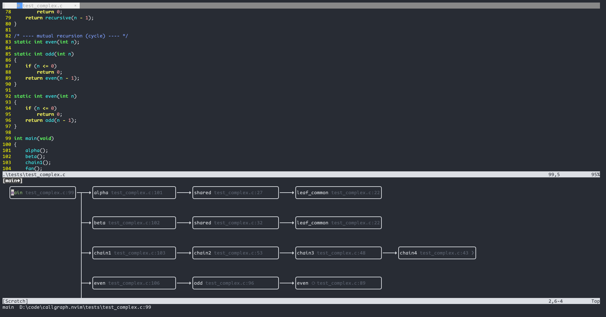
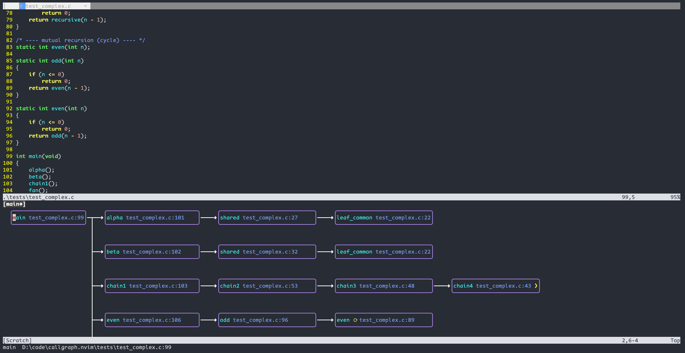

# callgraph.nvim

> **English** · [中文](README.zh.md)

A Neovim plugin that shows a **real function call graph** (a directed graph / flowchart), not an indent tree.

Callers are always on the **left**, callees on the **right**; edges are orthogonal polylines with arrowheads. Data comes from the LSP
[Call Hierarchy](https://microsoft.github.io/language-server-protocol/specifications/lsp/3.17/specification/#textDocument_prepareCallHierarchy) —
a language-agnostic, cross-file source — plus optional `cscope` / heuristic sources (see [Data sources](#data-sources)).

## Commands

| Command | Action |
|---|---|
| `:Callout` | Build the graph rooted at the function under the cursor — **what it calls** |
| `:Callin` | Build the graph rooted at the function under the cursor — **who calls it** |
| `:CallgraphLog` | Open the debug log file |
| `:CallgraphDebug on\|off` | Toggle debug logging at runtime |

## View

- Splits by default **below** the editor (`window.position` can be `right` / `bottom`); it is a read-only canvas buffer.
- The split keeps a fixed size (`fixed_width` columns for `right`, `fixed_height` rows for `bottom`; `0` = fit to content).
- A **winbar tab bar** on the view window: each tab is a function + direction, cycled with `<Tab>` / `<S-Tab>`. Reopening the same function + direction jumps to the existing tab instead of duplicating.
- The selected box's **function name is colored** (default green, `highlights.focus`), the location label `file:line` is **dimmed** (`highlights.loc`); `highlights.focus_bold` optionally bolds the name.
- `<Enter>` jumps to the definition and **keeps the view open**; only `q` / `<Esc>` close it (focus returns to the original window on close).

### Keymaps

| Key | Action |
|---|---|
| `h` `j` `k` `l` / arrows | move the selection (spatial nearest) |
| `<Space>` | expand / collapse the focused box |
| `<Enter>` / `d` | jump to the function definition (view stays open) |
| `<Tab>` `<S-Tab>` | cycle tabs |
| `q` `<Esc>` | close the current tab (closes the view when the last tab closes) |
| `r` | refresh |
| `i` / `o` | toggle callin / callout in place |
| `+` / `-` | depth +1 / -1 |
| `?` | keymap help |

Mouse: single click selects a box, **double-click** expands/collapses, scroll wheel scrolls the canvas.

## Features

- **Tree expansion**: every call path expands into its own nodes — the same function called from different places appears once per path (no dedup), so edges never cross and it's always clear who calls whom.
- **Depth limit**: `max_depth` defaults to 4 (at most 4 edges from the root). Boundary nodes collapse to a `▸` marker; Enter / double-click expands, `+` / `-` adjust depth.
- **Cycles**: when a back edge is detected the node is not expanded again; a highlighted **⟳** terminal is shown next to the name and no back edge is drawn.
- **Crossing-free edges**: rows are assigned so each subtree occupies a contiguous band; parent→child edges never overlap other edges.
- **Call-site labels**: each box shows the call site `file:line` (`show_call_site` can be turned off).
- **Long-name truncation**: over-wide function names are truncated to `…`; hovering shows the full path in the message area.
- **Auto-scroll**: moving the selection scrolls the canvas (horizontal/vertical) so the focused box stays visible.
- **Multiple tabs**: several function+direction graphs can be open at once in one view, shown in the winbar.
- **Multi-source**: call relationships can come from `lsp` / `cscope` / `ctags` / `auto` in the configured priority order; availability is probed once at startup and cached.
- **Query caching**: each symbol's callers/callees are fetched only once per session — tree expansion reaches the same function along many paths, so the underlying query (cscope / LSP / auto) is never repeated for it, including across rebuilds and expands.
- **Lazy.nvim friendly**: `documentSymbol` is cached in the background after `LspAttach`; opening a file costs zero.

## Data sources

`config.sources` lists the sources in priority order (`sources = { 'lsp', 'auto' }`). The plugin probes which are actually available on this machine (executable + index present) and caches the result:

- **`lsp`** (default first): LSP Call Hierarchy — language-agnostic, cross-file. `incomingCalls` (callin) needs clangd ≥ LLVM 12; `outgoingCalls` (callout) needs clangd **≥ LLVM 20** (landed 2024-12).
- **`cscope`**: cscope database queries (needs `cscope` + `cscope.out`; good for C/C++).
- **`ctags`**: ctags (reserved; not implemented yet).
- **`auto`** (fallback): heuristic single-file — callout scans the function body and resolves each call token via `prepareCallHierarchy`, falling back to **name matching against the file's documentSymbol** (handles call-before-declaration source); callin uses `references` + documentSymbol. **Single-file only** — cross-file calls cannot be resolved.

> Tip: use clangd ≥ 20 so both callin and callout use standard semantic analysis (cross-file, precise).
> With clangd < 20, callout automatically falls through to the next source (e.g. `auto`).

## Requirements

- Neovim **≥ 0.10**
- A language server. For C use **clangd** (≥ 20 for full callout/callin support)
- For cross-file / large projects, make sure a `compile_commands.json` exists and background indexing is ready

## Installation

```lua
-- lazy.nvim
{
  'mengq627/callgraph.nvim',
  cmd = { 'Callout', 'Callin' },
  keys = {
    { '<leader>co', '<cmd>Callout<CR>', desc = 'Call graph: callees' },
    { '<leader>ci', '<cmd>Callin<CR>',  desc = 'Call graph: callers' },
  },
  opts = {}, -- optional, see below
}
```

## Configuration

```lua
require('callgraph').setup({
  max_depth = 4,          -- maximum edges expanded from the root by default
  show_call_site = true,  -- show  file:line  inside each box
  sources = { 'lsp', 'auto' }, -- call-graph sources in priority order; the
                              -- first one that returns results wins. Available:
                              -- lsp / cscope / ctags (reserved) / auto (single-file
                              -- heuristic). Probed for availability at startup.
  highlight = true,       -- highlight toggle (on by default): color the focused
                          -- function name, dim the location label
  window = {
    position = 'bottom',     -- 'right' (vertical split) | 'bottom' (horizontal)
    fixed_width = 80,        -- right-layout fixed columns (0 = fit to content)
    fixed_height = 20,       -- bottom-layout fixed rows
    row_gap = 2,             -- vertical gap between stacked boxes in a column
    col_gap = 5,             -- horizontal gap between columns
    max_name_width = 26,     -- function name truncation
    max_loc_width = 22,      -- location label truncation
    arrows = { right='', down='', up='', left='' }, -- Nerd Font arrows
    collapse_marker = '❯',  -- expandable marker: '❯' thick | '▶' large | '▸' small | '▷' outline
  },
  highlights = {
    focus = 'CallgraphFocus',       -- focused function name color (default green)
    focus_bold = false,             -- bold the focused function name
    loc = 'CallgraphLoc',           -- location label color (default dim)
    tab_active = 'CallgraphTabActive',     -- current tab label
    tab_inactive = 'CallgraphTabInactive', -- other tab labels
  },
  colors = {
    -- Canvas colors: 'off' (default terminal colors) | 'auto' (mirror the code
    -- area: function name <- @function, file:line <- Comment, background <-
    -- Normal; edges white, borders bluish purple) | 'custom' (use the colors
    -- below).
    mode = 'auto',
    func = '#98c379',    -- function / symbol name (custom)
    location = '#5c6370', -- file:line label (custom)
    border = '#9d7cd8',  -- box border (custom)
    edge = '#ffffff',    -- connection lines (custom)
    focus = '#98c379',   -- focused function name (custom)
    symbol = '#e5c07b',  -- inline markers ⟳ cycle / ▸ collapsible (custom)
  },
  keymaps = {               -- all remappable; set to '' to disable
    move_left = 'h', move_down = 'j', move_up = 'k', move_right = 'l',
    move_left_alt = '<Left>', move_down_alt = '<Down>',
    move_up_alt = '<Up>', move_right_alt = '<Right>',
    toggle_expand = '<Space>',
    close = 'q', close_alt = '<Esc>',
    refresh = 'r',
    to_callin = 'i', to_callout = 'o',
    depth_up = '+', depth_down = '-',
    jump_to_def = '<CR>', jump_to_def_alt = 'd',
    tab_next = '<Tab>', tab_prev = '<S-Tab>',
    help = '?',
  },
})
```

### Color modes

`colors.mode` controls how the canvas is colored:

| `off` (default terminal colors) | `auto` (mirrors the code area) |
|---|---|
|  |  |

- **off**: plain terminal colors — borders, text and connection lines all use the default palette.
- **auto**: mirrors the code area — function name follows `@function`, `file:line` follows `Comment`, inline markers (⟳ / ❯) follow `@keyword`, background follows `Normal`, borders are bluish purple, edges white.
- **custom**: use the `colors.*` values above.

## Architecture

```
plugin/callgraph.lua  lazy entry point: registers :Callout / :Callin / :CallgraphLog / :CallgraphDebug
lua/callgraph/
  init.lua      setup(), public API, LspAttach background cache
  config.lua    defaults + merge + highlight group definitions
  source.lua    source manager: availability probe cache, combined fetch by
                sources priority, root resolution
  source/       symbol sources (each one way to query call relationships):
    lsp.lua       LSP call hierarchy (outgoing/incomingCalls)
    auto.lua      heuristic single-file (reuses scanner + fallback)
    cscope.lua    cscope database queries (-dL -2/-3)
    ctags.lua     ctags (reserved)
  lsp.lua       LSP tools: root resolution (prepareCallHierarchy + documentSymbol), jump to definition
  graph.lua     graph build: recursive fetch (tree, no dedup), cycle detection, depth clip (pure logic, injected fetch)
  scanner.lua   pure-C call-site scanner (skips comments/strings/preprocessor, returns call tokens)
  fallback.lua  heuristic fetch: callout body-scan + name match, callin via references
  layout.lua    layered layout + orthogonal edge routing (pure functions)
  render.lua    draw the graph into the canvas buffer + highlight extmarks
  view.lua      split view, tabs (winbar), keymaps, mouse, hover echo
```

The core (graph / scanner / layout / render) is pure logic and can be tested without an LSP.

## Development / Testing

All tests live in `tests/`, run from the repo root:

```bash
nvim --headless -u NONE -l tests/load_check.lua        # every module loads
nvim --headless -u NONE -l tests/smoke.lua             # no server: graph/layout/render/scanner/fallback
nvim --headless -u NONE -l tests/repro_move.lua        # cursor placement regression while moving
nvim --headless -u NONE -l tests/tabs.lua              # tabs: reuse/switch/close + winbar
nvim --headless -u NONE -l tests/scroll.lua            # horizontal scroll keeps the box visible
nvim --headless -u NONE -l tests/ui.lua                # no server: split view / navigation / expand / close
nvim --headless -u NONE -l tests/integration.lua       # real clangd: clean.c callout(fallback) + callin
nvim --headless -u NONE -l tests/integration_testc.lua # real clangd: test.c name-match fallback
nvim --headless -u NONE -l tests/integration_lsp.lua   # clangd ≥ 20: pure-LSP callout 4 levels + callin
nvim --headless -u NONE -l tests/cscope.lua            # cscope provider: output parse / index discovery / availability
nvim --headless -u NONE -l tests/integration_complex.lua # test_complex.c: diamond / cycles / fan-out / deep chain
nvim --headless -u NONE -l tests/e2e_callout.lua         # end-to-end: open file, place cursor, run :Callout (CI)
nvim -u NONE -l tests/e2e_callout.lua                    # same, but with a real window — watch it run
nvim -u NONE -l tests/e2e_demo.lua                       # movie-style demo: opens a window and walks through
                                                         # open->cursor->:Callout->move->callin->expand in steps
```

`tests/smoke.lua` covers: tree expansion (a symbol appears once per call path), cycle terminals, callin mirror,
`max_depth` boundary collapse, expand/collapse, the C call-site scanner, fallback orchestration, same-column arrows.
`tests/clean.c` is well-formed sample source; `tests/test.c` is a call-before-declaration diamond sample.

### Coverage (luacov)

Every test runs under a vendored [luacov](https://lunarmodules.github.io/luacov/) (`tests/vendor/luacov/`, pure Lua, no external deps).

```bash
# run all tests + print the coverage summary
nvim --headless -u NONE -l tests/run_coverage.lua

# additionally check that newly added lines are covered
nvim --headless -u NONE -l tests/run_coverage.lua --diff origin/main
```

Rules:

- **Tests are a hard gate**: every push / PR must pass the full suite (`test` job).
- **Coverage is a non-blocking gate**: push and PR both report new-code coverage (`--diff <base>` marks newly added **executable** lines that aren't exercised as `UNCOVERED NEW LINE`; lines in `lua/callgraph` files no test loads are also flagged). It **never blocks the merge** — a committer can force-merge.
- **Exempting branches**: wrap deliberately-untested branches (e.g. defensive / error handling) in `-- luacov: disable` / `-- luacov: enable` comments; those lines count neither as misses nor as new-code requirements.
- GitHub Actions (`.github/workflows/ci.yml`): one job — tests + coverage summary are the hard gate; the new-code coverage check reuses the same run's report (`--no-run`, `continue-on-error`) on push and PR and shows the result without blocking. `luacov.report.out` is uploaded as a build artifact.
